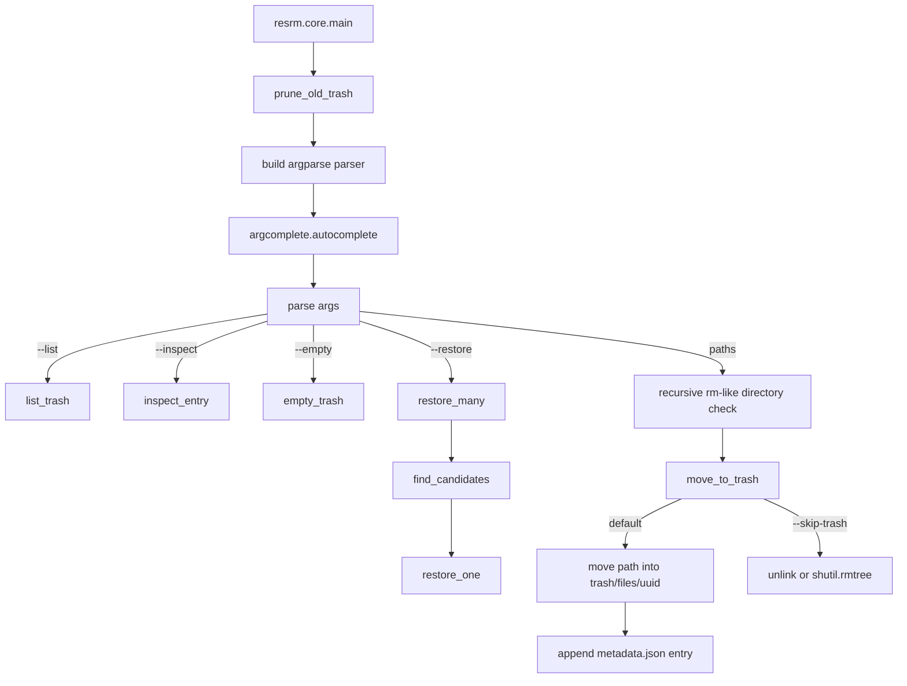

# resrm Development Guide

Interested in the internals of resrm?

This guide describes the current `resrm` codebase for maintainers. It focuses on how the project is organised, what calls what, how removed files flow into the trash store, and which invariants matter when changing the code.

---

## 1. What resrm does

`resrm` is a command-line replacement for common `rm` usage. By default it moves files and directories into a per-user trash directory instead of permanently deleting them.

Its core pipeline is:

```text
Filesystem path
  |
  | resrm PATH
  v
Per-user trash directory
  files/<uuid>      moved file or directory
  metadata.json     original path, uuid, deletion timestamp
  |
  | resrm --restore ID_OR_BASENAME
  v
Restored path
  original location, or current directory if the original path exists
```

`resrm` deliberately keeps the implementation simple. It does not try to be a full desktop-trash implementation, filesystem snapshot tool, backup system, sandbox, or forensic recovery tool.

The main data stored for a trashed item is:

```text
id          random uuid hex string
orig_path   resolved original path
timestamp   deletion time in ISO format
```

Permanent deletion is still available with:

```bash
resrm --skip-trash PATH
```

Trash entries are also permanently removed by automatic pruning and by `resrm --empty`.

---

## 2. Repository layout

The project is a small Python package under `src/resrm/`.

```text
src/resrm/
  __init__.py              package marker
  cli.py                   console-script shim that imports core.main
  core.py                  CLI, trash metadata, restore, delete, prune logic

tests/
  __init__.py              test package marker; no substantive tests currently

pyproject.toml             Poetry package metadata and console script
poetry.lock                locked dependency graph
README.md                  user-facing documentation
LICENCE                    GPL-3.0-or-later licence text
.pre-commit-config.yaml    Bandit, Black, and generic pre-commit hooks
.gitea/workflows/          lint, dependency audit, SBOM and Grype workflows
dist/                      built release artifacts, not source
```

The installed command is configured in `pyproject.toml`:

```toml
[tool.poetry.scripts]
resrm = "resrm.cli:main"
```

`src/resrm/cli.py` currently contains only:

```python
from resrm.core import main
```

All runtime behaviour is in `src/resrm/core.py`.

---

## 3. Main runtime flows

### 3.1 CLI entry flow

All user-facing behaviour enters through `resrm.core.main()`.

```text
resrm command
  -> resrm.cli.main import shim
  -> resrm.core.main(argv)
     -> prune_old_trash()
     -> build argparse parser
     -> install argcomplete hooks
     -> parse arguments
     -> dispatch to list, inspect, empty, restore, or remove branch
```

The supported action surface is:

```text
PATH...                  move paths to trash by default
-r                       allow directories
-f, --force              ignore missing paths and suppress interactive prompt
-i                       ask before removing each path
--skip-trash             permanently delete instead of moving to trash
-l, --list               list current user's trash metadata
--restore ITEM...        restore by id prefix or exact basename
--inspect ITEM...        show metadata and filesystem details for matches
--empty                  permanently remove all current user's trash entries
-V, --version            print installed package version
```

### 3.2 Subcommand call graph



Current dependency direction is intentionally minimal:

```text
cli.py
  imports core.main only

core.py
  depends on argparse, argcomplete, json, os, shutil, sys, uuid,
  datetime, textwrap, importlib.metadata, pathlib, and standard library
  pwd/grp/stat imports in platform-specific helper paths
```

If the codebase grows, prefer moving focused behaviours into modules such as `trash.py`, `metadata.py`, and `restore.py` rather than making `core.py` larger.

---

## 4. Trash storage

Trash storage is local filesystem state. There is no database server.

For the effective uid running the command, `get_trash_paths()` returns:

```text
trash directory: <base>/files
metadata file:   <base>/metadata.json
```

The base path is chosen by `get_trash_base_for_user(uid)`:

```text
uid 0:      /root/.local/share/resrm
other uid:  <home from pwd.getpwuid(uid)>/.local/share/resrm
fallback:   Path.home()/.local/share/resrm
```

At import time, these globals are initialised:

```python
TRASH_DIR, META_FILE = get_trash_paths()
meta = load_meta()
```

Because `meta` is loaded once at import time, code that changes metadata on disk through a different metadata file must load and save that file explicitly.

### 4.1 Metadata format

`metadata.json` is a JSON list of dictionaries.

Example entry:

```json
{
  "id": "f7f3e07ef50a4ec8be0a843f79fbdf1a",
  "orig_path": "/home/alice/project/file.txt",
  "timestamp": "2026-06-28T10:24:03.123456"
}
```

Important details:

```text
id          generated with uuid.uuid4().hex
orig_path   stored as str(path.resolve()) after the move succeeds
timestamp   generated with datetime.datetime.now().isoformat()
```

There is no schema version field at the time of writing. If metadata format changes, decide whether old metadata files need migration or tolerant reading.

### 4.2 Trash object naming

Trashed filesystem objects are moved to:

```text
<trash base>/files/<uuid hex>
```

The original basename is not used in the stored filename. User-facing commands expose the first eight characters through `short_id()`.

Short ids are convenient but not guaranteed globally unique. `find_candidates()` treats the provided identifier as an id prefix after checking exact basename matches.

---

## 5. Data objects

The codebase currently uses dictionaries rather than dataclasses.

Metadata dictionaries are expected to contain:

```text
id: str
orig_path: str
timestamp: str
```

Primary helpers that consume metadata entries:

```text
short_id(fullid)             returns first eight characters
human_time(ts)               displays ISO timestamp as YYYY-MM-DD HH:MM
entry_display(entry, width)  formats one list-style row; currently unused
find_candidates(identifier)  exact basename first, then id prefix
restore_one(entry)           moves files/<id> back to a target path
inspect_entry(identifier)    prints details from metadata and lstat
```

If adding richer metadata, update every helper that assumes these keys exist.

---

## 6. Removing paths

The removal entry point is the path-processing branch in `main()`.

```text
PATH...
  -> for each argument
  -> reject directory unless -r is provided
  -> move_to_trash(path, interactive, force, skip_trash)
```

`move_to_trash()` handles several behaviours:

```text
missing path:
  -f/--force: ignore
  otherwise: print an rm-like error

interactive mode:
  -i without -f prompts before removal

--skip-trash:
  directory and not symlink: shutil.rmtree(path)
  otherwise: path.unlink()

default trash mode:
  reject root-owned path unless running as euid 0
  choose trash base from owner uid when possible
  move path to files/<uuid>
  append metadata entry to that owner's metadata.json
```

### 6.1 Directory handling

The CLI mimics common `rm` behaviour for directories:

```text
directory without -r: print "Is a directory" and skip
directory with -r: move the directory tree to trash
directory with -r --skip-trash: permanently remove it with shutil.rmtree
```

There is no separate `-R` alias at the time of writing.

### 6.2 Force and interactive behaviour

`-f` suppresses errors for missing paths and disables the interactive prompt in `move_to_trash()` because the prompt only runs when `interactive and not force`.

`-i` asks:

```text
remove 'PATH'? [y/N]
```

Only the exact answer `y` proceeds.

### 6.3 Root-owned files

Before moving to trash, `move_to_trash()` checks:

```python
st = path.stat()
if st.st_uid == 0 and os.geteuid() != 0:
    print("resrm: permission denied: ... (root-owned file, try sudo)")
    return
```

This is a product guardrail. It avoids giving non-root users the impression that `resrm` can safely or consistently manage root-owned files. It is not a privilege boundary by itself.

### 6.4 Owner-based trash selection

Default trash mode selects the trash base from the file owner's uid when possible, not necessarily from the invoking user's uid:

```text
owner uid -> pwd.getpwuid(owner_uid).pw_dir -> ~/.local/share/resrm
fallback  -> current TRASH_DIR.parent
```

This matters for `sudo resrm`: root can move a user-owned file into that user's resrm trash area instead of root's global trash area.

If changing this behaviour, consider restore visibility, ownership, sudo workflows, and existing metadata files.

---

## 7. Listing and inspecting trash

### 7.1 Listing

`list_trash()` reads the in-memory `meta` list for the current effective user and prints:

```text
ID        Deleted at           Original path
--------  -------------------  -------------
```

Long paths are shortened from the left to fit a display width of 80 characters.

`list_trash()` does not verify that each corresponding `files/<id>` object still exists. It displays metadata state.

### 7.2 Inspecting

`inspect_entry(identifier)` uses `find_candidates()` and prints details for every matching entry:

```text
ID
Original
Deleted at
Stored at
Type
Size
Permissions
Ownership
```

It uses `trash_path.lstat()` so symlink entries are inspected as symlinks rather than through their targets. Type display currently distinguishes directories, symlinks, and files.

`--inspect` uses the current effective user's global `TRASH_DIR` and `meta`, so it inspects the trash visible to the invoking user.

---

## 8. Restoring files

Restore is driven by `restore_many()` and `restore_one()`.

```text
--restore ITEM...
  -> for each item
  -> find_candidates(item)
  -> if no match: print and continue
  -> if one match: restore_one(entry)
  -> if multiple matches: prompt for selection
```

Candidate lookup is intentionally simple:

```text
1. exact basename match against Path(entry["orig_path"]).name
2. id prefix match against entry["id"].startswith(identifier)
```

Exact basename matches take priority over id prefix matches.

### 8.1 Restore target path

`restore_one()` starts with:

```python
src = TRASH_DIR / entry["id"]
dest = Path(entry["orig_path"])
```

If the original destination already exists, restore falls back to the current directory with the original basename:

```python
if dest.exists():
    dest = Path.cwd() / dest.name
```

Then it creates parent directories and moves the trashed object:

```python
dest.parent.mkdir(parents=True, exist_ok=True)
shutil.move(str(src), str(dest))
```

After a successful move, it removes the metadata entry from `meta` and saves the current metadata file.

### 8.2 Restore limitations

Current restore behaviour does not provide conflict resolution beyond the current-directory fallback. If that fallback destination also exists, `shutil.move()` may fail or may apply platform-dependent behaviour.

Restore does not validate that `entry["orig_path"]` is safe, expected, or still belongs to the user. The metadata file is trusted local state selected by the invoking user.

---

## 9. Pruning and emptying trash

### 9.1 Automatic pruning

`main()` calls `prune_old_trash()` before argument parsing. This means any invocation can delete old trash entries before performing the requested action.

The retention period is controlled by:

```text
RESRM_TRASH_LIFE
```

Rules:

```text
default:        7 days
invalid value:  7 days
minimum:        1 day
```

Entries older than the cutoff are removed from `TRASH_DIR/files/<id>` and from `meta`. Directories are removed with `shutil.rmtree(..., ignore_errors=True)`. Files are removed with `unlink(missing_ok=True)`.

### 9.2 Emptying trash

`empty_trash()` permanently removes every object directly under the current user's `TRASH_DIR`, clears `meta`, and writes the empty metadata list.

There is no confirmation prompt for `--empty` at the time of writing. Treat changes to this behaviour as user-facing compatibility changes.

---

## 10. Symlink behaviour

Symlink handling depends on the operation:

```text
default trash mode:
  shutil.move moves the symlink itself when the path argument is a symlink

--skip-trash:
  path.is_dir() and not path.is_symlink() uses shutil.rmtree
  otherwise path.unlink removes the symlink itself

inspect:
  lstat is used and symlink targets are displayed with os.readlink
```

One important detail: the root-owned-file guard currently uses `path.stat()`, which follows symlinks. If changing symlink semantics, review that guard carefully and decide whether `lstat()` is more appropriate for the intended security model.

---

## 11. Development commands

Install dependencies:

```bash
poetry install
```

Run the CLI in the development environment:

```bash
poetry run resrm --help
```

Run pre-commit hooks:

```bash
poetry run pre-commit run --all-files
```

Build release artifacts:

```bash
poetry build
```

There is a `tests/` package marker, but no substantive pytest suite is configured in `pyproject.toml` at the time of writing. If tests are added, add pytest as a development dependency and prefer focused tests using temporary directories and isolated metadata files.

---

## 12. Automation and security scanning

Gitea pull request workflow:

```text
.gitea/workflows/lint-and-security.yml
  -> install pre-commit
  -> pre-commit run --all-files
  -> install Poetry and poetry-plugin-export
  -> poetry export dependencies
  -> pip-audit dependency audit
```

Scheduled/manual security workflow:

```text
.gitea/workflows/security-scan.yml
  -> install verified Cosign, Syft, and Grype
  -> generate SBOM
  -> scan for vulnerabilities
  -> notify Node-RED on fixable Medium/High/Critical vulnerabilities
  -> fail workflow on those vulnerabilities
```

Pre-commit currently includes Bandit, Black, trailing whitespace, EOF, YAML, and TOML checks.

Bandit is configured for `src/resrm/` with:

```text
-lll -iii -s B110,B112
```

Be careful when suppressing security checks. Prefer making the code obviously safe and documenting intentional tradeoffs.

---

## 13. Common maintenance tasks

### 13.1 Add a new CLI option

1. Add the argparse option in `core.py`.
2. Decide whether it affects removal, restore, listing, inspection, pruning, or emptying.
3. Update argcomplete if the option accepts trash identifiers.
4. Update README usage examples.
5. Update this guide if the runtime flow or safety model changes.
6. Add focused tests if a test suite exists, or add the test infrastructure if the behaviour is important enough to protect.

### 13.2 Change metadata format

1. Update the metadata writer in `move_to_trash()`.
2. Update `load_meta()`, `save_meta()`, `find_candidates()`, `restore_one()`, `inspect_entry()`, and `list_trash()` as needed.
3. Decide whether old metadata files should continue to work.
4. Consider adding a `version` field before making incompatible changes.
5. Add tests with temporary metadata files.

There is currently no migration system. Do not silently break existing user metadata unless the project intentionally accepts that compatibility break.

### 13.3 Change trash location semantics

Start with these functions and call sites:

```text
get_trash_base_for_user()
get_trash_paths()
move_to_trash() owner-based trash selection
restore_one() source path construction
inspect_entry() stored path display
```

Important questions:

1. Which user should own the trash entry when running under sudo?
2. Which metadata file should `--list`, `--restore`, and `--inspect` read?
3. What happens to existing trash entries under the old path?
4. Does the change affect root-owned files or normal user files differently?

### 13.4 Change restore behaviour

Start with `find_candidates()`, `restore_many()`, and `restore_one()`.

Preserve these expectations unless intentionally redesigning the tool:

```text
restores by exact basename or id prefix
prompts when there are multiple candidates
does not overwrite an existing original path
removes metadata only after a successful move
prints a clear failure message when restore fails
```

If adding overwrite or merge behaviour, require explicit user intent and document the consequences.

### 13.5 Change permanent deletion behaviour

Start with the `skip_trash` branch in `move_to_trash()`, `prune_old_trash()`, and `empty_trash()`.

Permanent deletion paths are the highest-risk parts of the tool. Review directory handling, symlink handling, error reporting, and confirmation semantics before changing them.

### 13.6 Add tests

Good first test areas:

```text
get_trash_base_for_user chooses expected paths
load_meta returns [] for missing or malformed metadata
find_candidates prioritises exact basename before id prefix
move_to_trash moves files and writes metadata
move_to_trash rejects directories without -r at the CLI layer
--skip-trash removes a symlink rather than its target
restore_one restores to original path when free
restore_one falls back to current directory when original path exists
prune_old_trash honours default, invalid, and minimum retention values
empty_trash clears files and metadata
```

Use temporary directories and monkeypatch module globals such as `TRASH_DIR`, `META_FILE`, and `meta` to avoid touching a real user's trash.

---

## 14. Important maintenance hazards

### 14.1 Import-time global state

`TRASH_DIR`, `META_FILE`, and `meta` are initialised at import time. This keeps the script simple, but it makes testing and multi-user behaviour easier to get wrong.

If refactoring, consider passing a small trash context object through functions instead of relying on globals.

### 14.2 Metadata is trusted local state

Restore uses `orig_path` from metadata to decide where to create parent directories and move restored files. Do not treat arbitrary attacker-controlled metadata as safely sandboxed input.

### 14.3 `--empty` and pruning are permanent

The default remove flow is reversible, but `--empty`, auto-prune, and `--skip-trash` are not. Keep this distinction clear in code paths and documentation.

### 14.4 Short ids can collide

The display id is the first eight characters of a UUID. Code should be prepared for multiple matches and should not assume an eight-character prefix uniquely identifies an entry.

### 14.5 Basename lookup can be ambiguous

Exact basename restore is convenient but ambiguous. `restore_many()` prompts when multiple candidates match. Preserve that behaviour when changing lookup logic.

### 14.6 Symlink and ownership checks need care

Some operations use `stat()` and some use `lstat()`. Be explicit about whether the code should operate on a symlink itself or its target.

### 14.7 Root and sudo workflows are product-sensitive

The README promises sudo support for root-owned files. Changes that affect euid handling, owner-based trash paths, root-owned rejection, or `/root/.local/share/resrm` should be tested manually under sudo before release.

### 14.8 Existing user trash matters

Users may have real files in `~/.local/share/resrm/files` and important metadata in `metadata.json`. Migration and compatibility decisions can affect their ability to restore data.

---

## 15. Troubleshooting guide

### 15.1 `resrm` says a path is root-owned

The path's owner uid is `0`, and the current effective uid is not root. Re-run with sudo if you intentionally want root to manage that path.

### 15.2 A directory is not removed

Like `rm`, `resrm` requires `-r` for directories:

```bash
resrm -r directory
```

### 15.3 A restored file does not return to its original path

If the original path already exists, `restore_one()` restores to the current directory using the original basename.

### 15.4 A trash item is missing

Check, in order:

1. Was it removed with `--skip-trash`?
2. Was it removed by `resrm --empty`?
3. Was it pruned because it was older than `RESRM_TRASH_LIFE` days?
4. Are you running as the same effective user that owns the relevant trash metadata?
5. Was it moved into the file owner's trash while running through sudo?

### 15.5 Completion does not show entries

Check that argcomplete is installed and registered for the shell:

```bash
eval "$(register-python-argcomplete resrm)"
```

Completion candidates come from the metadata loaded for the current effective user.

### 15.6 Pruning happens unexpectedly

Every `resrm` invocation calls `prune_old_trash()` before parsing arguments. Check `RESRM_TRASH_LIFE`; invalid values fall back to 7 days and values below 1 are treated as 1 day.

---

## 16. Practical code-reading map

```text
Feature/question                         Start with
CLI option behaviour                     core.py:main()
Console script entry point               pyproject.toml and cli.py
Trash base path                          get_trash_base_for_user()
Current user's trash globals             get_trash_paths(), TRASH_DIR, META_FILE
Metadata loading/saving                  load_meta(), save_meta()
Automatic pruning                        prune_old_trash()
Listing trash                            list_trash()
Identifier matching                      find_candidates()
Restore flow                             restore_many(), restore_one()
Permanent delete                         move_to_trash(skip_trash=True)
Default move to trash                    move_to_trash(skip_trash=False)
Inspection output                        inspect_entry()
Shell completion                         id_name_completer inside main()
Packaging                                pyproject.toml
Automation                               .gitea/workflows/ and .pre-commit-config.yaml
```

---

## 17. Glossary

**Trash base** The directory containing `files/` and `metadata.json` for one user.

**Trash file directory** The `files/` directory under the trash base, containing UUID-named moved objects.

**Metadata file** The JSON file that records ids, original paths, and timestamps.

**Trash id** The full UUID hex string generated for a trashed object.

**Short id** The first eight characters of a trash id, used for display and restore convenience.

**Original path** The resolved path stored before a moved object is restored.

**Skip trash** Permanent deletion mode enabled with `--skip-trash`.

**Prune** Automatic permanent deletion of old trash entries according to `RESRM_TRASH_LIFE`.

---

## 18. Final maintenance model

Most changes should preserve this model:

```text
Move paths into a per-user trash area by default
  -> store minimal metadata needed to find and restore them
  -> list, inspect, and restore from trusted local metadata
  -> avoid overwriting existing original paths during restore
  -> reserve permanent deletion for explicit or retention-based flows
```

Before changing code, ask:

1. Is this a remove, restore, metadata, pruning, or presentation concern?
2. Does this touch permanent deletion or only trash movement?
3. What happens to existing `metadata.json` files?
4. Which effective user and which file owner should control the trash entry?
5. Does the change behave correctly under sudo?
6. Does it operate on symlinks or symlink targets?
7. Does it preserve non-overwrite restore behaviour?
8. Are `--skip-trash`, `--empty`, and auto-prune clearly documented as permanent?
9. Are there focused tests or manual checks for the edge case being changed?

Keeping those boundaries clear is the main way to maintain `resrm` without turning a narrow safer-rm utility into a misleading backup or sandbox tool.
